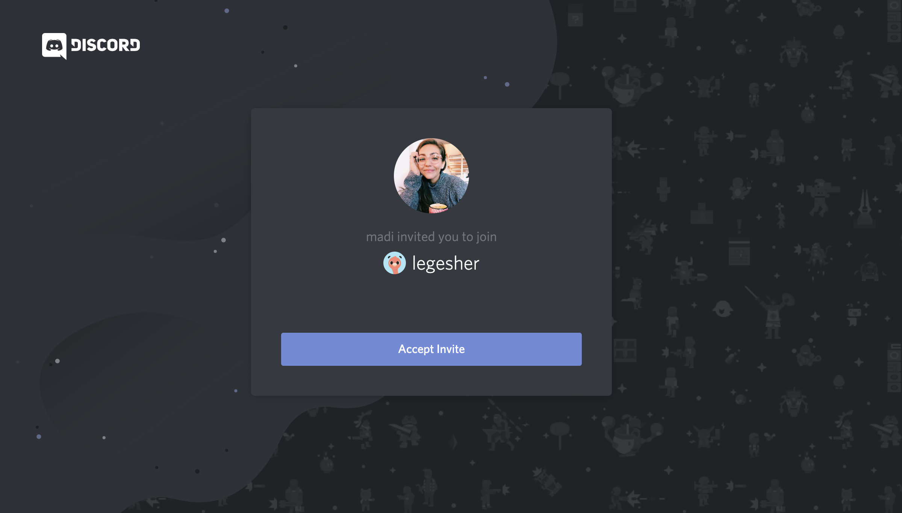
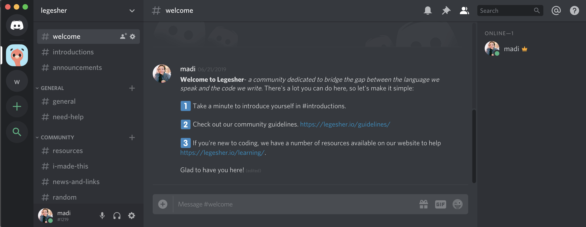
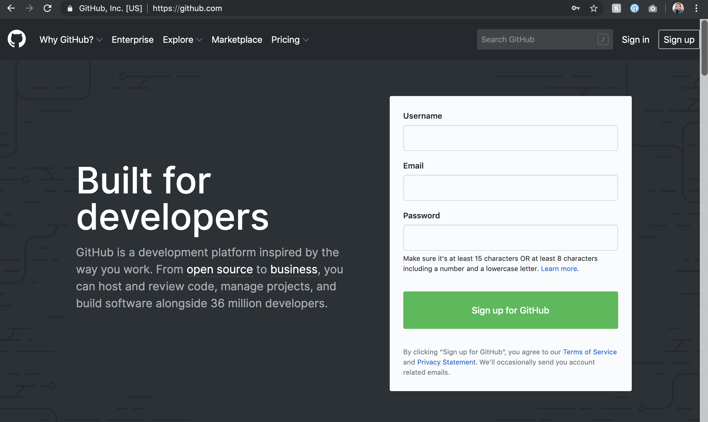
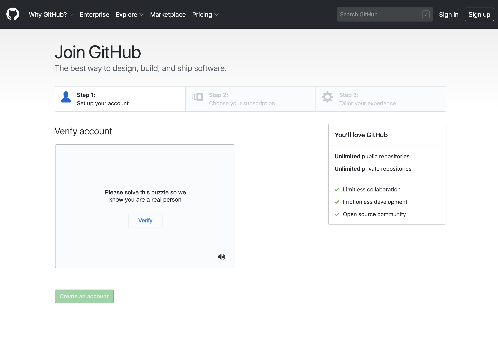
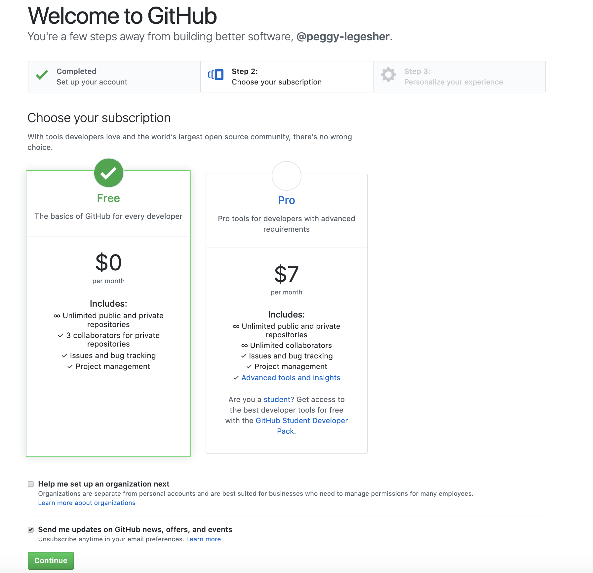
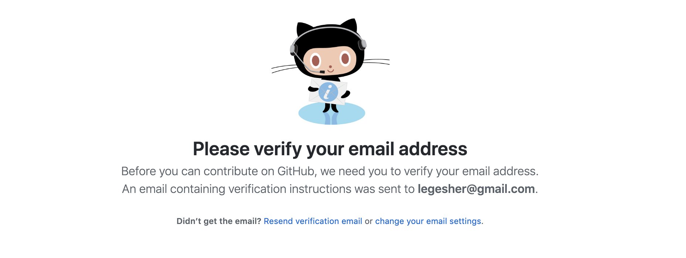
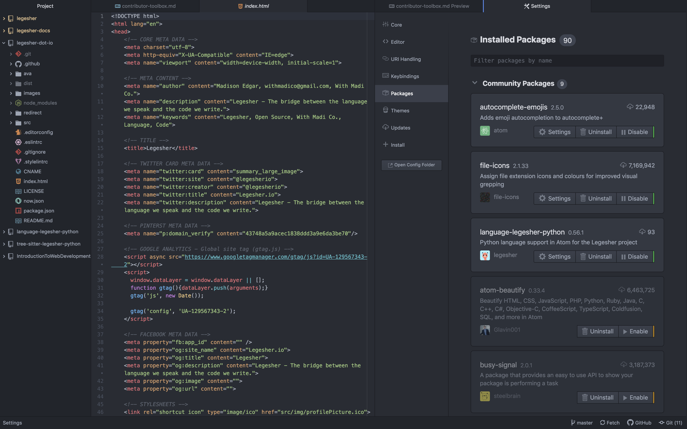

# Getting Started

> So where do we start?

_Great question!_ Below are a couple of different tools that will be important in contributing to the project. There are many ways to contribute to Legesher - most of which you only need wifi access! 

We'll walk the installation of each tool, their purpose, and how we use them within in Legesher. 

But above all, **enjoy**!

## Table of Contents

The best place to start is to evaluate what _exactly_ you have in your toolbox and what else you need to obtain. The few key tools that are essential to contributing to Legesher: **Discord**, a **Github account** and a **text editor** \(Atom\). 

* [The Pride w/ Discord](getting-started.md#the-pride)
* [The Code w/ Github](getting-started.md#the-code)
* [The Platform w/ Atom](getting-started.md#the-platform)

## The Pride

> **Pride** - A community of ostriches

Community is extremely important to us, and having a designated space for all of us to connect and challenge each other as we share our gifts is what _Discord_ provides us.

> **Discord** - Communication platform built to create and foster a strong, inspiring community

### Getting Connected


Welcome to the Pride, [click here to enter](https://discord.gg/yvsprVf)! 


This link will take you to this page. Discord is similar to any other communication platform - like `Slack` or `Cisco Spark`, but allows us to focus on a key feature we love within the Legesher community - our voice.

### Navigating The Community

You can either open Discord up in the browser using their web application or you can download the desktop app \(recommended\) to access the community. Once you've given us a name to call you by, you will see this page.

On Discord, you'll be able to connect with other inspiring individuals like yourself as you contribute towards Legesher.  
1⃣ Introduce yourself on the `#introductions` channel  
2⃣Check out our[ Code of Conduct](../the-official-things/untitled.md)  
3⃣ Learn [how to contribute](../the-official-things/contributing-guidelines.md) to Legesher

**Servers** After you accept the invitation to join Legesher's Discord Community, you are essentially adding the Legesher server to your Discord account. The far left-hand column contains all of the servers you as a user are connected to.

**Channels**  
The column next to the server list contains all of the channels within a specific server. You start with being in the `#Welcome` channel.

* `#introductions`: place to connect with other members of the pride.
* `#announcements`: place where major updates will be communicated.

Every channel has a short description that details the manner of the conversation within that specific channel. If you have questions regarding a specific part of the project, finding the channel that relates would be the best place to ask it!

## The `Code`

Obviously, a very important aspect of Legesher is the code itself. Whether you are wanting to contribute as an experienced developer or writer or marketer, we want the code to excite you and not bring you anxiety. Allow us to explain further with one of the tools you will come to love!

### What is Github

> Github - a system that uses git, a version control software so you can version, share, collaborate and deploy code.

_TONS_ of buzz words there ^, so let's break it down!

**Github**  
Github is like a social media platform for developers. Instead of posting photos, you’re posting your coding projects. You can “like” other’s projects ⭐ and follow other people to stay updated with their work. You can “repost” projects and add your own twist to them by forking 🍴.

Github is also like Google Drive, where it hosts all of the content and assets for your projects in larger files called _repositories_. A repository has all of the code, images, assets, etc. needed for a particular project. Github has its own version of "revision history" to trace back what a specific document / project looked like at a specific moment in time. You hit save or _commit_ to create a checkpoint in your project to reference back to.

**Git**  
Git is the version control software that Github uses to keep track of what is happening to your coding projects.

_**What does version control mean?**_  
Anytime you work in your project, anytime you save a change \(in git we call that `committing a change`\), you’re able to go back to that “snapshot” of the project and restart from there if you find yourself in a pigeon hole. Just like checkpoints in video games, if you fail a challenge you can restart at the checkpoint. Best thing about git, is that you can create checkpoints whenever and however often you want!

_**Why use a version control software?**_  
I put every project on Github, because you can never predict when your laptop is going to crash/get stolen and you don’t want to lose all the work you’ve done. In college, I started writing my essays in Google Drive so I can work anywhere and the auto-saves literally save my butt anytime my computer crashed. \(And now, Google Drive has “revision history” so it's now even a little more like git\)

With a version control software you are able to work anywhere, with anyone, at anytime. _Pretty cool, huh?_

### Creating a Github Account

You might already feel lost - you just decided you want to help on this project but right out of the bag you're faced with a hurdle of unknown. That helplessness you feel is exactly the type of feeling the programmers we're building this tool for experience! Let's get through this together, and learn a lot in the process.

1⃣ Navigate to [Github](https://github.com) to create a new account. Enter your desired username, associated email address and secret password.

2⃣ Verify you're not a robot 🤖by going through the exercise.

3⃣ Once verified human, select your subscription \(free is more than fine\). You don't need to select the `Help me set up an organization next` for you will be contributing to the `Legesher` organization's repositories to start!

4⃣ You will then need to verify your email address to finish setting up your account. \(Also, feel free to email `legsher@gmail.com` for questions, concerns, or funny memes.\)

5⃣ After you verified your account, you can access your profile. This is where other developers can see what you've been working on and connect with you.

**Repositories**  
You repositories will be available to view here \(unless they are private repositories, then they will only be visible to you\).

**Projects**  
This is for larger, overarching initiatives that belong to a project.

**Stars** ⭐  
If you come across a repository that you think is awesome, you want to refer to later on, or any other reason - give it a star ⭐! This encourages the developer\(s\) working on it that you see their work, and allows you to come back to the repository later on.

**Followers/Following**  
Just like any other basic social media platform, you are given the ability to follow and be followed by others.

6⃣ Let's dive into Legesher and how to contribute! Feel free to star any \(or all lol\) of these repositories and follow any of our team members because they're inspiring people just like you!

## The Platform

> Text Editor - interface that allows you to open and edit your code in an user-friendly environment

Text editors can do a number of amazing things for your code - including autocorrect and color formatting. Great text editors keep track of key words and variables that you set, so you spend less time searching and debugging your code and more time implementing your solution. At this time, we are only actively working on extensions for [Atom](https://atom.io).

The text editor is a foundational element for the Legesher project. The syntax highlighting of keywords is a key element to the success of our code.

### Introduction to Atom \(Text Editor\)

In the Atom text editor, you can add `packages` to enhance the capabilities of the editor. This is where many of the **legesher** packages will be made available / what we will be building off of. For example, on the image above you can see the `language-legesher-python` package _installed_ and _enabled_ on my editor.

